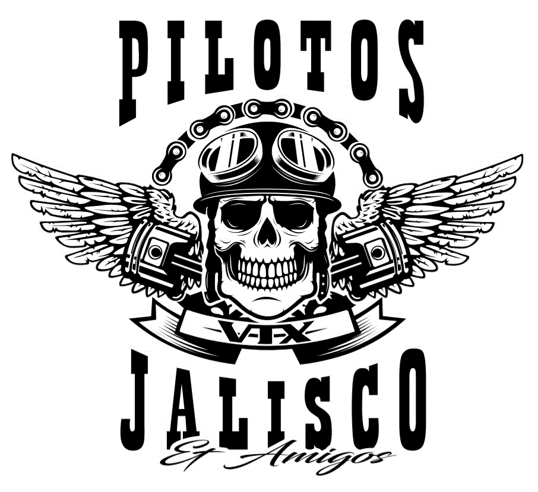

# Pilotos VTX Jalisco y Amigos MG

Bienvenido al repositorio oficial del sitio web de **Pilotos VTX Jalisco y Amigos MG**, un club de motociclistas con sede en Jalisco, México. Este sitio celebra la hermandad, la pasión por las motos y el orgullo jalisciense.

## 🚀 Enlace en vivo

Accede al sitio web aquí: [https://tuusuario.github.io/pilotos-vtx-jalisco](https://tuusuario.github.io/pilotos-vtx-jalisco)

## 📸 Secciones del sitio

- **Inicio**: Mensaje de bienvenida y presentación del club
- **Galería**: Fotos de rutas, eventos y encuentros
- **Eventos**: Calendario de próximas actividades
- **Contacto**: Formulario conectado a WhatsApp para mensajes directos

## 🛠️ Tecnologías utilizadas

- HTML5
- CSS3
- JavaScript (para conexión con WhatsApp)
- GitHub Pages (hosting gratuito)

## 📲 Contacto

Para unirte al club o colaborar en el sitio, contáctanos vía WhatsApp desde el formulario o directamente al número: `+52XXXXXXXXXX`

---

Este sitio es mantenido por César y la comunidad de Pilotos VTX Jalisco. ¡Rodamos juntos, vivimos libres!
